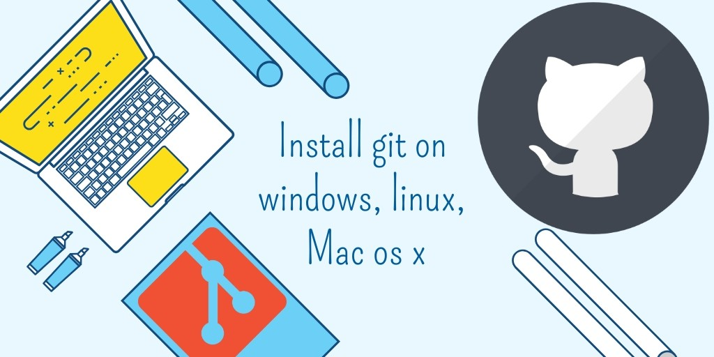

# Curso de git

 * ¿Qué es git?
 * ¿Qué es control de versiones?
 * Beneficios de control de versiones
 * Instalación

 

## ¿Qué es git?

> Git es un software de control de versiones creado por Linus Torvalds, pensando en la eficiencia, la confiabilidad y compatibilidad del mantenimiento de versiones de aplicaciones cuando estas tienen un gran número de archivos de código fuente. Su propósito es llevar registro de los cambios en archivos de computadora incluyendo coordinar el trabajo que varias personas realizan sobre archivos compartidos en un repositorio de código.


## ¿Qué es control de versiones?

> Control de versiones es la práctica de llevar un registro de cambios y administración de cambios en el desarrollo de software.
> Un software de control de versiones guarda un registro de cada modificación en el código en una base de datos. Si hubiese que restaurar un estado, se puede volver a versiones anteriores y compararlas para solucionar las inconsistencias.


 

## Beneficios de control de versiones

> Mantener el desarrollo siempre actualizado

> Evitar duplicación de contenido

> Eliminar contenido no utilizado u obsoleto

> Registrar breves descripciones actualizadas del desarollo

> Compartir el desarrollo




## Instalación

> Podemos instalar el sistema de control de versiones git [desde el sitio oficial](https://git-scm.com/)
> En windows se instalará git y además git bash.

> Podremos comprobar la instalación con el comando

```bash
git --version
```

> git en macOS

```bash
brew install git
```

> git en Debian

```bash
sudo apt-get install git-all
```

> git en fedora

```bash
sudo dnf install git-all
```

